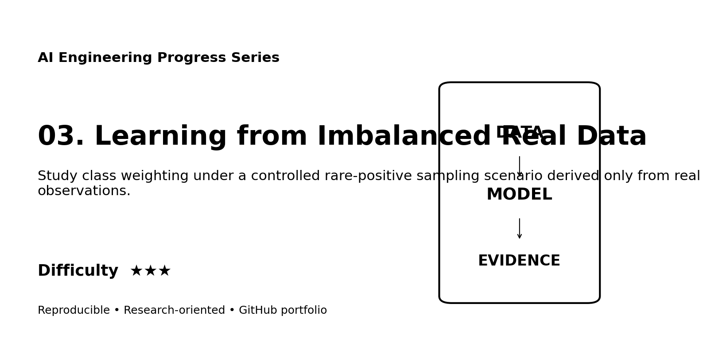
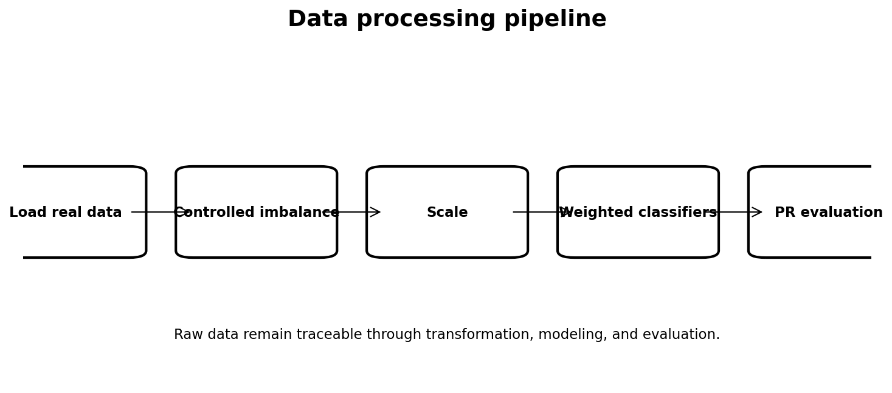
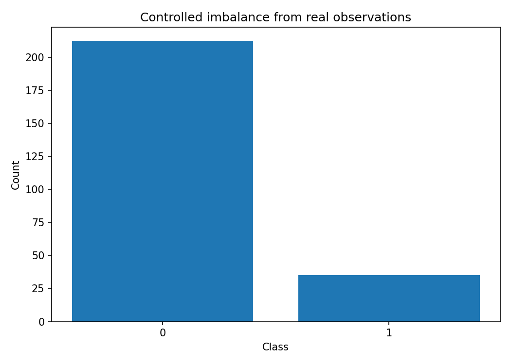
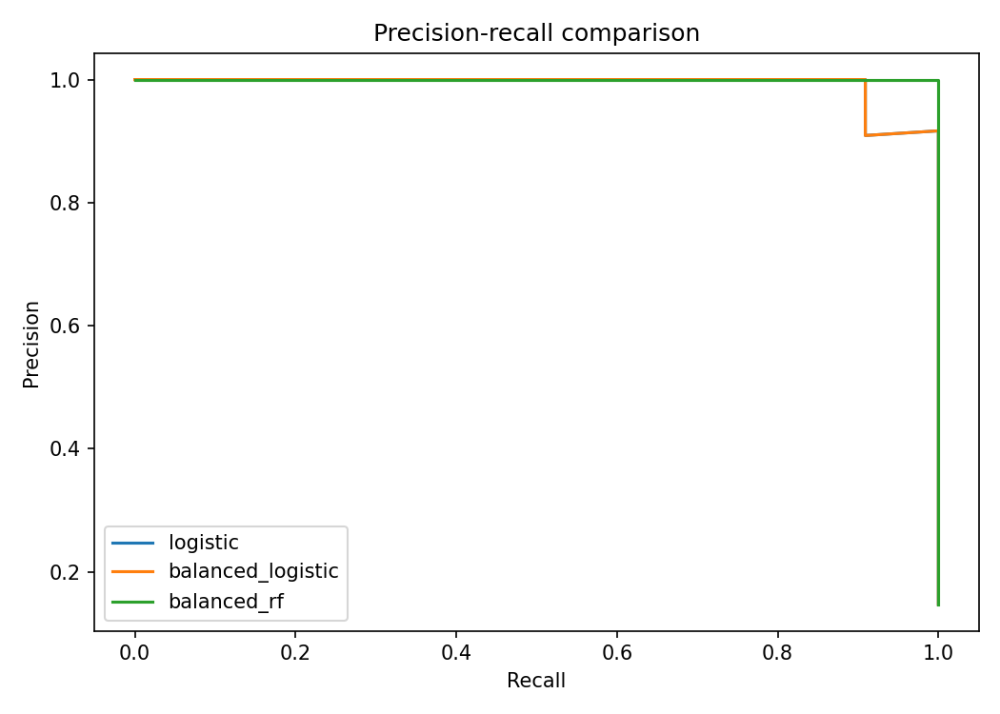

# Web Portfolio Card

## Learning from Imbalanced Real Data

**Track:** AI Engineering  
**Difficulty:** ★★★  
**Dataset:** Wisconsin Diagnostic Breast Cancer dataset  
**Quick description:** Study class weighting under a controlled rare-positive sampling scenario derived only from real observations.

### Suggested website image gallery

### Suggested portfolio copy
This project demonstrates imbalanced learning, precision-recall, class weighting, robust evaluation using a reproducible workflow with explicit data provenance, processing, evaluation, limitations, and research documentation. The repository includes executable code and a scientific-style technical report suitable for supervisor review.
