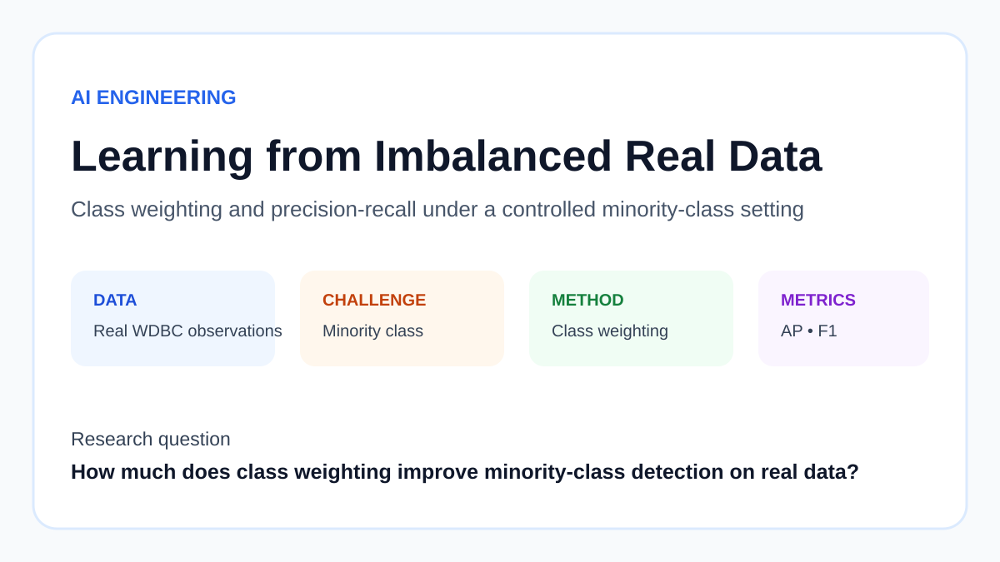
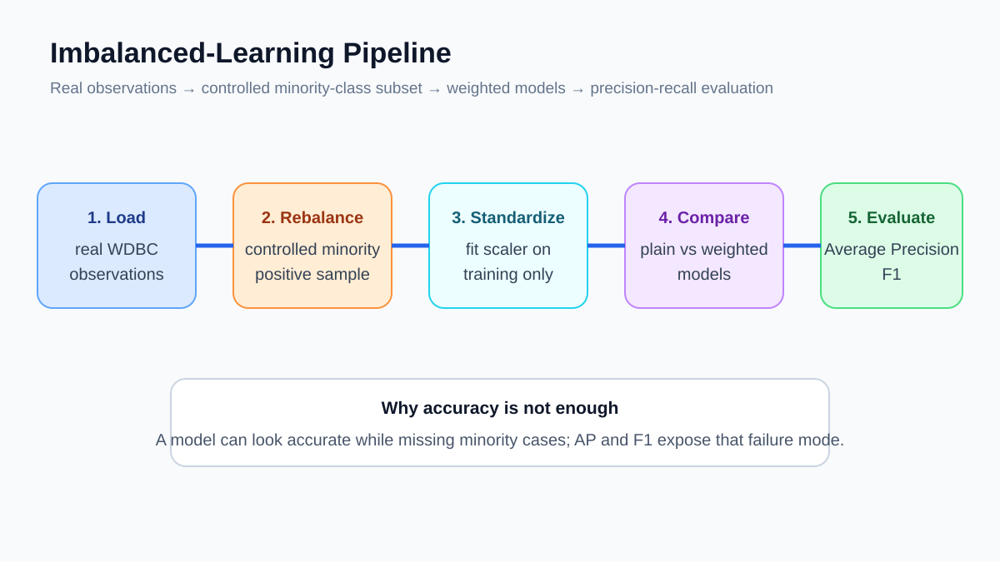
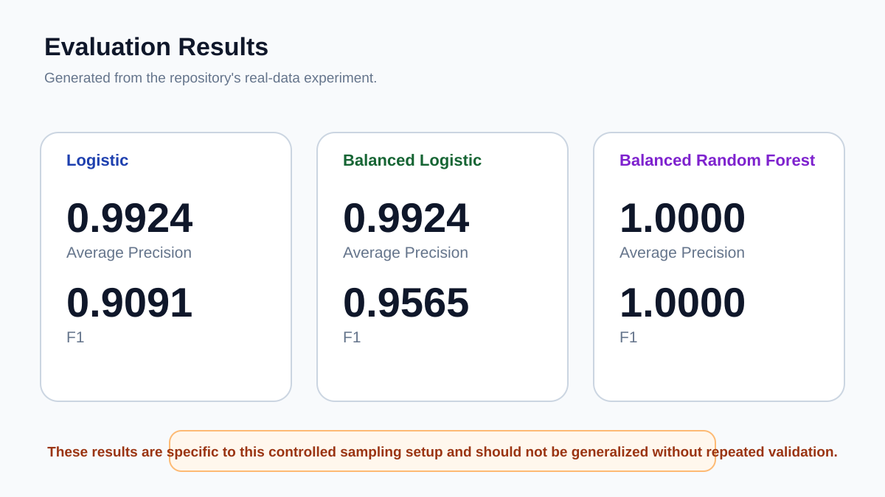

# Learning from Imbalanced Data



I built this project to see how class imbalance changes model behaviour, especially when the less common class is the one I care about detecting.

Rather than generating synthetic rows, I start with real observations from the Wisconsin Diagnostic Breast Cancer dataset and create a controlled imbalance by keeping all class-0 cases and only a seeded subset of class-1 cases.

## Data setup

The original data come from scikit-learn's breast cancer dataset. For this experiment I keep:

- 212 observations from class 0;
- 35 observations from class 1.

This is a deliberately imbalanced study design. It is not meant to represent real medical prevalence.

More detail is in [DATA.md](DATA.md).

## How the experiment works



I compare three models:

1. standard logistic regression;
2. logistic regression with `class_weight="balanced"`;
3. Random Forest with `class_weight="balanced"`.

The data are split 70/30 with stratification. Logistic regression is fitted inside a scaling pipeline. The Random Forest uses 350 trees.

Because accuracy can be misleading on imbalanced data, I focus on Average Precision and F1.

## What class weighting changes


Class weighting does not create new samples. It changes the cost of mistakes during training so the less common class has more influence on the fitted model.

That makes it a useful first comparison before moving to oversampling or synthetic-data methods.

## Results



The recorded run produced:

| Model | Average Precision | F1 |
|---|---:|---:|
| Logistic regression | 0.9924 | 0.9091 |
| Balanced logistic regression | 0.9924 | 0.9565 |
| Balanced Random Forest | 1.0000 | 1.0000 |

The balanced logistic model improved F1 without changing Average Precision in this split. The Random Forest reached perfect scores on the held-out sample.

I do not treat that perfect result as proof of a perfect model. The test set is small and the imbalance was created for this experiment. Repeated validation would be needed before drawing a stronger conclusion.

## Run it

```bash
python -m venv .venv
source .venv/bin/activate
pip install -r requirements.txt
python src/run_experiment.py
```

On Windows, use `.venv\Scripts\activate`.

## Repository notes

- [DATA.md](DATA.md) explains the sampling setup.
- [REPRODUCIBILITY.md](REPRODUCIBILITY.md) explains how to repeat the experiment.
- [ETHICS.md](ETHICS.md) explains why these results should not be treated as a medical decision rule.
- [paper/paper.md](paper/paper.md) contains the longer technical write-up.
