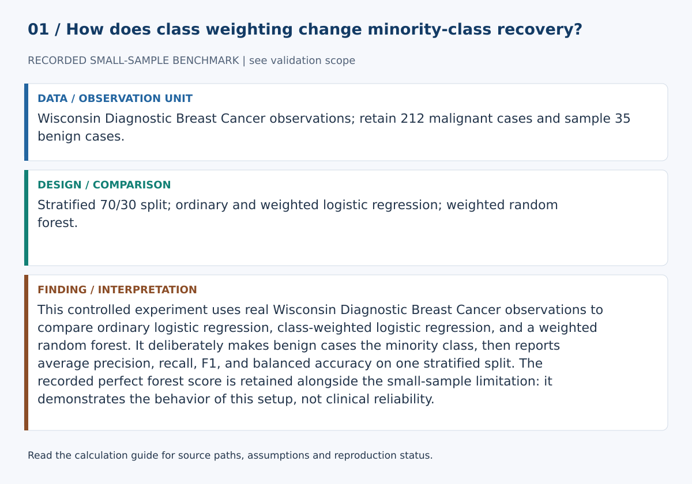
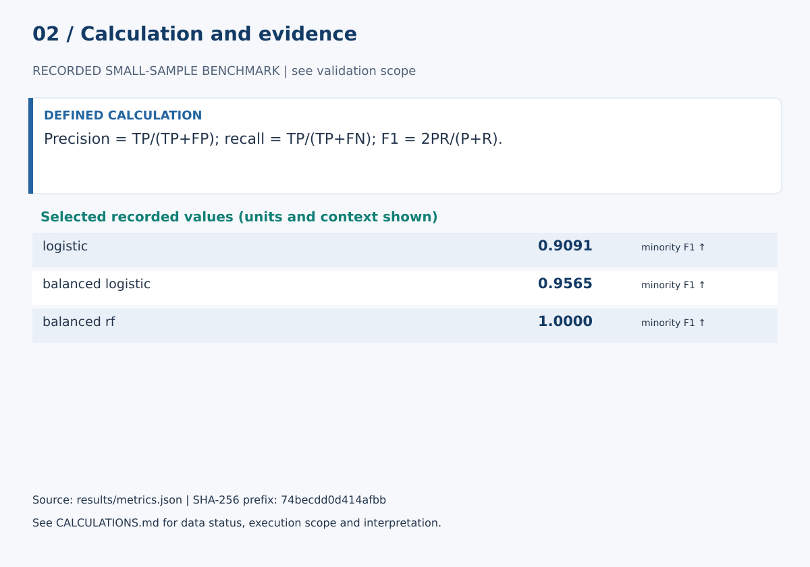

# Learning from Imbalanced Data

## Abstract

This study examines how class weighting changes classification behaviour under a controlled minority-class setting. Real observations from the Wisconsin Diagnostic Breast Cancer benchmark are used; no synthetic patient rows are generated. All class-0 cases are retained and 35 class-1 cases are selected with seed 42.

## Method

The controlled sample contains 247 observations. A stratified 70/30 train/test split is used. Three models are compared: ordinary logistic regression, class-weighted logistic regression, and a class-weighted Random Forest. Evaluation reports Average Precision, F1, precision, recall, and balanced accuracy.

## Recorded results

| Model | Avg. Precision | F1 | Precision | Recall | Balanced Acc. |
|---|---:|---:|---:|---:|---:|
| Logistic | 0.9924 | 0.9091 | 0.9091 | 0.9091 | 0.9467 |
| Balanced logistic | 0.9924 | 0.9565 | 0.9167 | 1.0000 | 0.9922 |
| Balanced Random Forest | 1.0000 | 1.0000 | 1.0000 | 1.0000 | 1.0000 |

## Interpretation

Class weighting improves minority recall for logistic regression in this split. The perfect Random Forest score is not treated as proof of a perfect model because the minority test sample is small and the imbalance was deliberately constructed.

## Limitations

A stronger study would repeat the controlled subsampling across many seeds, report confidence intervals, separate threshold selection from final evaluation, and validate on external data.

## Responsible use

This is a machine-learning benchmark exercise, not a medical model.

## Calculation definitions and evidence audit

Precision = TP/(TP+FP); recall = TP/(TP+FN); F1 = 2PR/(P+R).

Class 1 is benign in this constructed experiment. Average precision summarizes ranking; threshold metrics describe one operating point. The minority test sample is small, and the deliberately altered prevalence is not clinical prevalence.

This controlled experiment uses real Wisconsin Diagnostic Breast Cancer observations to compare ordinary logistic regression, class-weighted logistic regression, and a weighted random forest. It deliberately makes benign cases the minority class, then reports average precision, recall, F1, and balanced accuracy on one stratified split. The recorded perfect forest score is retained alongside the small-sample limitation: it demonstrates the behavior of this setup, not clinical reliability.

The [calculation guide](../CALCULATIONS.md) provides exact evidence paths and a function-level implementation map.

### Selected evidence and interpretation

| Quantity | Value | Unit / meaning | JSON path |
|---|---:|---|---|
| logistic | 0.9090909090909091 | minority F1 ↑ | `models.logistic.f1` |
| balanced_logistic | 0.9565217391304348 | minority F1 ↑ | `models.balanced_logistic.f1` |
| balanced_rf | 1.0 | minority F1 ↑ | `models.balanced_rf.f1` |

These values are read from `results/metrics.json`. They must be interpreted with the split, data status and limitations above. The complete data/model experiment was not rerun in this review.

### Reproduction and claim boundaries

The existing suite requires unavailable dependencies; no full-suite pass is claimed. The figure generator can be checked with `python scripts/build_review_figures.py --check`. This verifies the displayed calculation evidence, not an independent replication of the complete scientific experiment. The manuscript is a working report, not a peer-reviewed publication.
